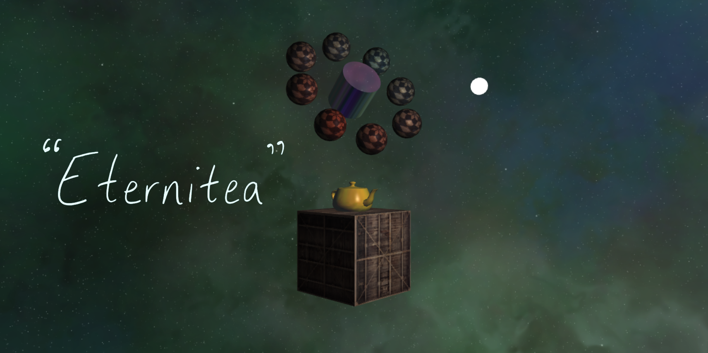

# Eternitea

This repo contains all the source code, resources, and build settings for _Eternitea_ - a digital art piece created over the course of a few months while studying computer graphics.

<p align="center">
  
</p>

## Getting Started

1. Clone the repo.
2. Install Node.js if you haven't already (and if you do have to install it, make sure to restart your PC afterwards).
3. Navigate to the root directory of the project in the shell/terminal/command line.
4. Initialize the project by running `npm install`.
5. Test the project as a live server by running `npm run serve`.
6. Build the project by running `npm run build`. The output is stored in the `dist` folder.

## Controls

_Eternitea_ allows users to explore an animated 3D scene composed of hierarchical transformations with real-time lighting, texture-mapping, and environment-mapping. They can control how the scene is viewed including the position/rotation of the camera's pivot point and the position of the light source in the scene. There are also extra controls to view the objects in the scene as wireframe meshes and to reset any changes the user has made.

Here's the list of controls:

```
- Move
  - Forward:        w
  - Left:           a
  - Backward:       s
  - Right:          d
- Look
  - Increase Yaw:   Shift + y
  - Decrease Yaw:   y
  - Increase Pitch: Shift + p
  - Decrease Pitch: p
  - Increase Roll:  Shift + r
  - Decrease Roll:  r
- Light
  - Forward:        I
  - Backward:       K
  - Left:           J
  - Right:          L
  - Up:             U
  - Down:           O
- Debug
  - Show Controls:  Shift + x
  - Hide Controls:  x
  - Reset:          `
  - Wireframe On:   t
  - Wireframe Off:  Shift + t
```

## Project Structure

The main technologies used for this project were TypeScript (for the source code) and Webpack (for the build pipeline).

### Motivation

The motivation for using TypeScript instead of JavaScript was to introduce static typing in an attempt to eliminate a class of bugs that made it difficult to complete similar projects. One of the most common errors in JavaScript is the `TypeError` that occurs when an object is not of the type you expected it to be. With TypeScript, you can be sure that an object passed into a method has certain properties as long as you declare a type for it (i.e. with `static foo(bar: string): string {...}` you know that `foo` is a method that performs some operation on a string and returns the result, which is nice because you don't have to check whether `bar` is a string).

The motivation for using Webpack was to streamline the process of transpiling TypeScript into JavaScript code because TypeScript cannot run directly in the browser. There were some unintended benefits that came with it, such as the ability to compile static resources into JavaScript objects (i.e. rather than embedding our shader code in the main `.html` page of our project, we store it in a separate `.glsl` file and use the [webpack-glsl-loader](https://www.npmjs.com/package/webpack-glsl-loader) to convert the object into a string and embed it into our code at compile-time). Additionally, Webpack condenses all your source code into a single minified JavaScript file, meaning your main `.html` file only needs 1 import script statement rather than N.

### Navigation

The project is split into directories containing the relevant data for building and running it. Here's the list of them, including an explanation of the significance of each:

-   `./`: The root directory, containing the build settings and all subdirectories for the project.
-   `./dist`: The output folder for the final build, containing the main `.html` file and the minified JavaScript code.
-   `./src`: The input folder for the build, containing all the project's source code and resources/data.
-   `./res`: Contains the project's configuration, mesh, and texture data.
-   `./src/styles`: Contains the stylesheet for the main `.html` file.
-   `./src/shaders`: Contains the source code for the `.glsl` vertex and fragment shaders.

## Code Structure

The project's source code is split into many small source files. Here's the list of them, including an explanation of the significance of each:

-   `camera.ts`: Determines the view matrix of the scene.
-   `color.ts`: Represents an RGBA color with component values from 0 to 1.
-   `component_factory.ts`: Encapsulates the creation of complex components such as primitive 3D objects.
-   `components.ts`: Stores the definition of the abstract base component and every other component in the scene. Components encapsulate update and render logic that requires entity state (i.e. such as an entity's position or rotation).
    -   `RotationController`: Updates the yaw, pitch, and roll of an entity based on user input.
    -   `MovementController`: Moves an entity along the x and z axes based on user input.
-   `constants.ts`: Holds commonly used constant/static values.
-   `cylinder.js`: [Imported code](http://www.songho.ca/opengl/gl_cylinder.html) for generating a cylinder object.
-   `entity_factory.ts`: Encapsulates the creation of complex entities, such as those that come with preattached 3D object components.
-   `entity.ts`: A spatial object that can be rendered and updated. Stores a list of related components that can modify it.
-   `input.ts`: Caches the state of input to allow for deferred input handling or polling.
-   `light.ts`: Represents an infinite point light source in the scene.
-   `main.ts`: The main file containing the entry method for the project.
-   `material.ts`: Represents a material with ambient, diffuse, specular, and shininess components.
-   `matrix4.ts`: A cherry-picked collection of methods from [glMatrix](https://glmatrix.net/docs/module-mat4.html) for performing 4x4 matrix operations.
-   `mesh.ts`: An interface to define the basic components of a mesh.
-   `primitive.ts`: Stores the main render logic for objects you can view in the scene.
-   `quaternion.ts`: A cherry-picked collection of methods from [glMatrix](https://glmatrix.net/docs/module-quat.html) for performing quaternion operations.
-   `render_state.ts`: Prepares the scene for rendering each frame and provides limited access to uniform locations and shader attributes for other renderable objects to access.
-   `shader_setup.ts`: Creates the shader program with its compiled/attached vertex and fragment
    shaders.
-   `skybox.ts`: A cube that is rendered around the camera, used to simulate the sky and distant scenery.
-   `spatial_object.ts`: Represents an object in 3D space that can be transformed.
-   `sphere.js`: [Imported code](http://www.songho.ca/opengl/gl_sphere.html) for generating a sphere object.
-   `template.html`: The template for the main `.html` file.
-   `texture_factory.ts`: Encapsulates the creation/loading of image resources into WebGL textures.
-   `vector3.ts`: Represents a 3D vector.
-   `world.ts`: Represents a 3D world, containing a list of entities and their components. Also includes most of the initialization for the project.

## Credits

-   Dim for the sphere texture: https://opengameart.org/content/dims-enviromental-and-architectural-textures.
-   glMatrix for quaternion and matrix math: https://glmatrix.net/.
-   Learn OpenGL for the container texture: https://learnopengl.com/img/textures/container.jpg.
-   Rye Terrell for the skybox texture(s): https://wwwtyro.github.io/.
-   Song Ho Ahn for the code to procedurally generate spheres and cylinders: http://www.songho.ca/.
-   WebGL2 Fundamentals for the skybox code: https://webgl2fundamentals.org/webgl/lessons/webgl-skybox.html.
